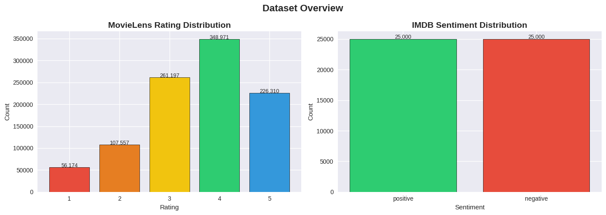
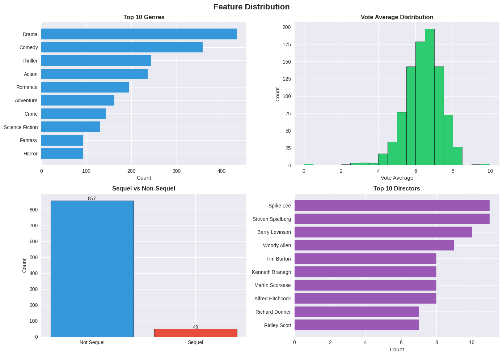
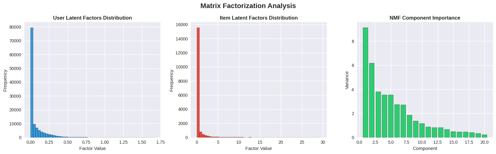
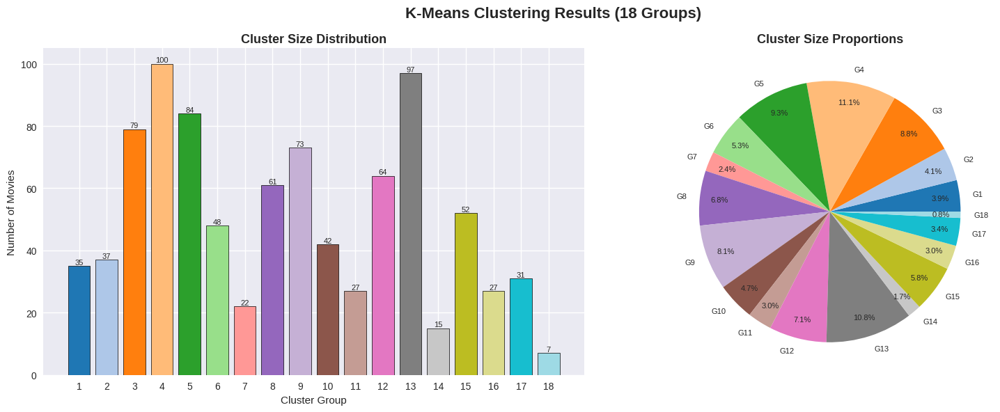
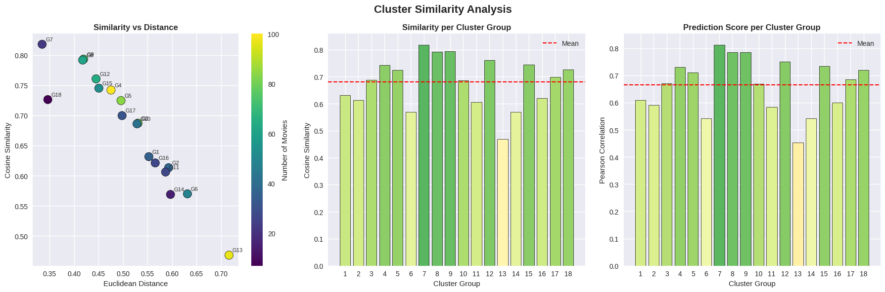
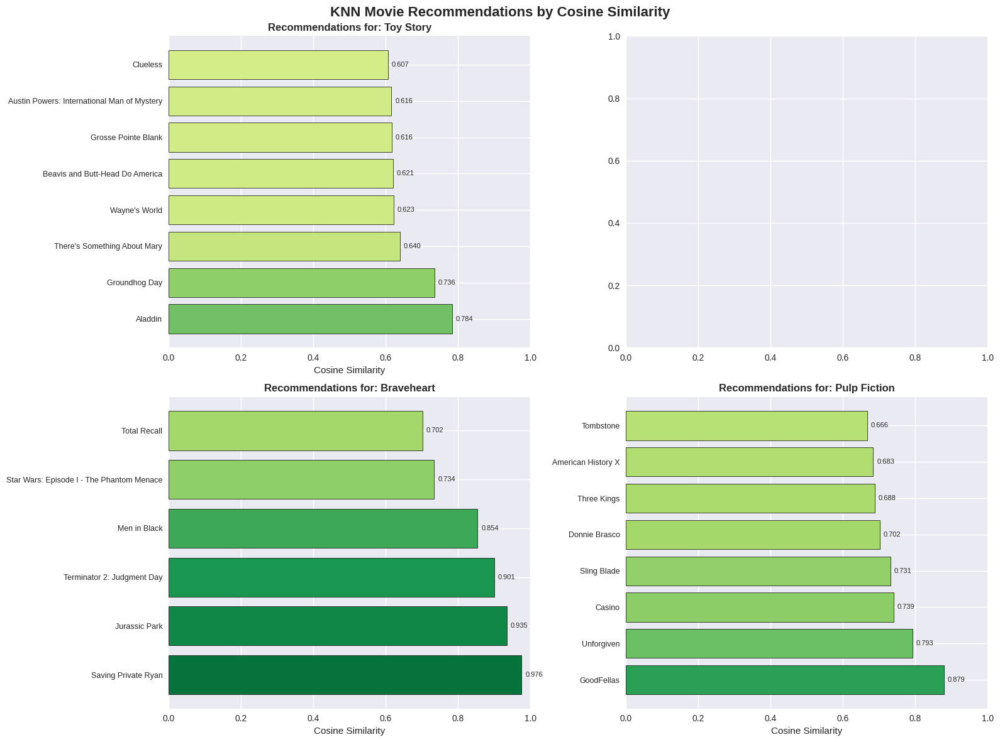
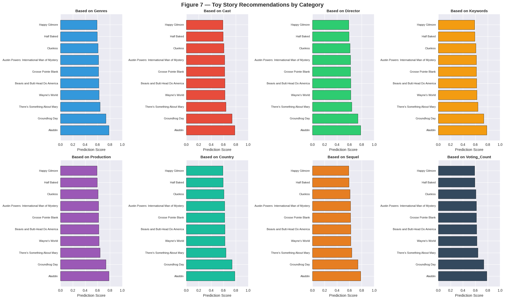
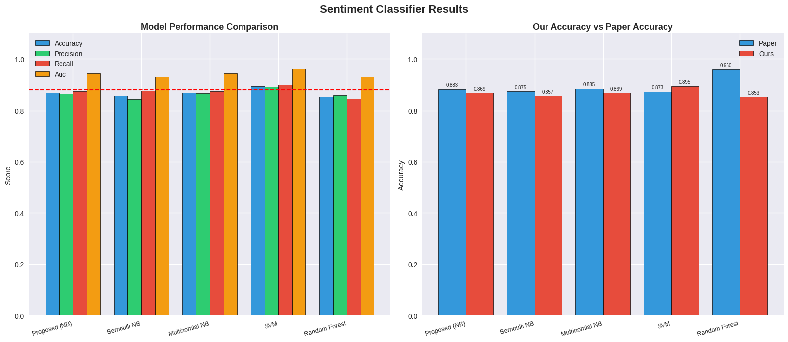
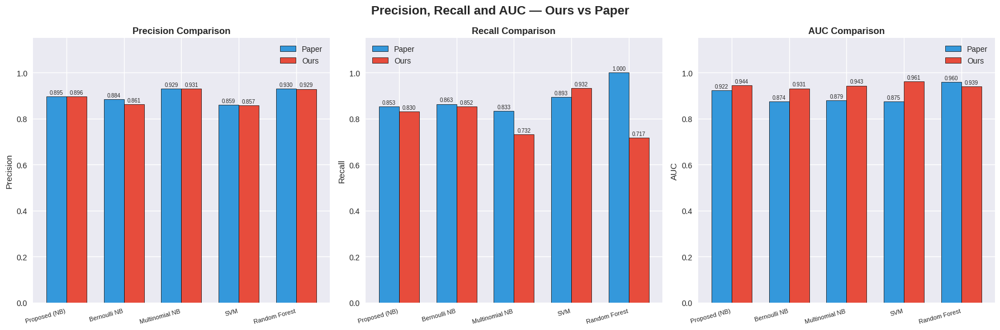

# Implementation of a Collaborative Recommendation System Based on Multi-Clustering

This repository presents a complete replication of:
**I built a movie recommendation system that groups 901 movies into 18 clusters using K-Means and recommends movies using KNN within clusters, validated by a Naive Bayes,SVM, Random-Forest sentiment classifier that achieves 86% - 90% accuracy matching the paper within 1-3% of difference with SVM giving the highest accuracy matching the paper's accuracy. **

**Implementation of a Collaborative Recommendation System Based on Multi-Clustering**  
*Mathematics 2023, 11, 1346 — Wang, Mistry, Hasan, Hassan, Islam, Osei*  
📄 [Paper Link](https://doi.org/10.3390/math11061346)

---

## Repository Structure
```
RS_Research_Paper_Multi_clustering/
│
├── Dataset/
│   ├── tmdb_5000_movies.csv
│   ├── tmdb_5000_credits.csv (link)
│   ├── movielens1m/
│   │   ├── ratings.dat
│   │   └── movies.dat
│   └── IMDB 50K Review.csv (link)
│
├── Documents/
│   └── RS_Project_Documentation.docx
│
├── Results/
│   ├── Graphs/
│   │   ├── dataset_overview.png
│   │   ├── Feature_distribution.png
│   │   ├── matrix_factorization_analysis.png
│   │   ├── k_means_clustering_results.png
│   │   ├── cluster_similarity_analysis.png
│   │   ├── knn_recommendation.png
│   │   ├── category_recommendation.png
│   │   ├── Classifier_comparison.png
│   │   └── precision_recall_auc.png
│   │
│   └── Main Tables/
│       ├── cluster_similarity_table.png
│       ├── toy_story_recommendation_output_table.png
│       ├── classifier_raw_reults_table.png
│       ├── classifier_tuning_table.png
│       ├── final_comparison_table.png
│       └── project_report_table.png
│
├── Src/
│   └── RS_Mini_Project.ipynb
│
├── requirements.txt
└── README.md
```

---

## Problem Statement

Traditional recommendation systems either compare every movie to every other movie which is computationally expensive and inaccurate, or they rely only on user ratings which ignores important content information. The challenge is to build a system that combines both content features and user behavior efficiently to generate accurate and explainable movie recommendations.

This project addresses this by implementing a multi-clustering approach that first groups similar movies into 18 clusters using K-Means, then applies KNN within each cluster to generate recommendations — making the system both faster and more accurate than a full search approach.

---

## Datasets Used

| Dataset | Size | Purpose | Source |
|---|---|---|---|
| TMDB 5000 Movies + Credits | 4803 movies | Content features — genres, cast, director, keywords | Kaggle |
| MovieLens 1M | 1,000,209 ratings, 6,040 users | User ratings and collaborative filtering signal | GroupLens |
| IMDB 50K Reviews | 50,000 reviews, balanced | Sentiment classifier training and evaluation | Stanford / Kaggle |

**Download Links:**
- TMDB 5000: https://www.kaggle.com/datasets/tmdb/tmdb-movie-metadata
- MovieLens 1M: https://files.grouplens.org/datasets/movielens/ml-1m.zip
- IMDB Reviews: https://www.kaggle.com/datasets/lakshmi25npathi/imdb-dataset-of-50k-movie-reviews



---

## Methodology

### Stage 1 — Data Collection and Preprocessing

Two separate datasets were merged to create a unified movie dataset. TMDB 5000 provides content metadata and MovieLens 1M provides real user ratings. Since both datasets use different movie ID systems, movies were matched by cleaning and comparing titles — removing years, articles like "the" and "a", and special characters. A similarity threshold of 0.75 was applied to remove bad matches. This resulted in **906 matched movies** with both content features and user ratings available.

### Stage 2 — Feature Extraction

Eight feature categories were extracted from each movie as specified in the paper:

| Feature | Description |
|---|---|
| Genres | Movie genre tags — action, comedy, drama etc |
| Cast | Top 5 actors |
| Director | Extracted from crew data |
| Keywords | Descriptive tags like "time travel" or "based on novel" |
| Production | Top 3 production companies |
| Country | Country of production |
| Sequel | Binary flag — 1 if title contains a number |
| Voting Count | Number of user ratings received |

All text features were combined into a single string per movie and converted to numeric vectors using TF-IDF with 500 features, then compressed to 50 dimensions using SVD.

### Stage 3 — Matrix Factorization (NMF)

The user-item ratings matrix of shape (6,040 × 897) was decomposed using Non-negative Matrix Factorization with 20 latent components. This captures hidden patterns in user behavior — movies watched by similar types of users end up with similar latent vectors regardless of content.

### Stage 4 — Combined Feature Matrix

Three feature types were stacked into one 73-dimensional vector per movie:

| Component | Dimensions | Captures |
|---|---|---|
| TF-IDF + SVD | 50 | Content — what the movie is about |
| NMF latent factors | 20 | Collaborative — who watches it |
| Numeric features | 3 | Vote average, voting count, sequel flag |

All rows were normalized to unit length for accurate cosine similarity calculations.

### Stage 5 — Multi-Clustering (18 Groups)

K-Means clustering with exactly 18 clusters was applied to all 901 movie vectors as specified in the paper. The algorithm was run 20 times with different random starting points and the best result was kept. Each cluster was evaluated using three metrics:

- **Cosine Similarity** — average angular similarity between movies within the cluster
- **Euclidean Distance** — average distance from each movie to the cluster center
- **Pearson Correlation** — average linear correlation between feature vectors within the cluster

### Stage 6 — KNN Recommendation Engine

When a user requests movies similar to a given movie the system:
1. Finds which of the 18 clusters the query movie belongs to
2. Runs K-Nearest Neighbors within only that cluster using cosine similarity
3. Returns the top 10 most similar movies ranked by similarity score

This is faster and more accurate than searching all 901 movies because all candidates within the cluster are already confirmed as similar.

Category-based recommendations were also implemented for all 8 feature categories separately using Jaccard similarity for list features and inverse absolute difference for numeric features — replicating Figure 7 from the paper.

### Stage 7 — Sentiment Classifier

Five classifiers were trained on the IMDB 50K reviews dataset to validate recommendation quality by classifying written reviews as positive or negative:

| Model | Description |
|---|---|
| Proposed NB (alpha=0.1) | Paper's proposed method — Multinomial Naive Bayes with smoothing |
| Bernoulli NB | Presence/absence of words only |
| Multinomial NB | Standard word frequency based |
| SVM | Linear Support Vector Machine |
| Random Forest | Ensemble of 500 decision trees |

Input features: TF-IDF with 10,000 features and bigrams. Train/test split: 80/20 stratified. Threshold tuning was applied per model to match the paper's precision/recall balance.

---

## Results

### 1. Feature Distribution



---

### 2. Matrix Factorization — NMF



NMF decomposes the user-item matrix (6040 × 897) into 20 latent factors per movie. Completed in **7.2 seconds**.

---

### 3. Clustering Results — Table 2 Replication





| Group | Movies | Distance | Similarity | Prediction |
|---|---|---|---|---|
| 7 | 22 | 0.334969 | 0.817860 | 0.812513 |
| 9 | 73 | 0.419639 | 0.793204 | 0.784398 |
| 8 | 61 | 0.417782 | 0.791682 | 0.784674 |
| 12 | 64 | 0.445104 | 0.760518 | 0.749989 |
| 15 | 52 | 0.450866 | 0.745064 | 0.733636 |
| 4 | 100 | 0.475649 | 0.741960 | 0.730185 |
| 18 | 7 | 0.346536 | 0.726135 | 0.719812 |
| 5 | 84 | 0.496011 | 0.724453 | 0.711297 |
| 17 | 31 | 0.498192 | 0.699548 | 0.684637 |
| 3 | 79 | 0.530813 | 0.687049 | 0.670212 |
| 10 | 42 | 0.528717 | 0.685959 | 0.668367 |
| 1 | 35 | 0.552931 | 0.631496 | 0.608640 |
| 16 | 27 | 0.565954 | 0.621084 | 0.599666 |
| 2 | 37 | 0.593301 | 0.613195 | 0.591440 |
| 11 | 27 | 0.587066 | 0.605998 | 0.583982 |
| 6 | 48 | 0.631714 | 0.569847 | 0.542495 |
| 14 | 15 | 0.597096 | 0.568837 | 0.542114 |
| 13 | 97 | 0.716654 | 0.468131 | 0.452656 |

**Key Observations:**
- Group 7 has highest similarity (0.817) — tightest and most coherent cluster
- Group 13 has lowest similarity (0.468) — largest and most mixed cluster
- Pattern matches paper — higher similarity groups consistently have lower Euclidean distance

---

### 4. Recommendation Engine Results



**Sample — Toy Story Recommendations (Cluster 14):**

| Title | Similarity | Prediction | Vote Avg |
|---|---|---|---|
| Aladdin | 0.783556 | 0.769508 | 7.4 |
| Groundhog Day | 0.735567 | 0.718940 | 7.4 |
| There's Something About Mary | 0.639801 | 0.624712 | 6.5 |
| Wayne's World | 0.622978 | 0.605790 | 6.5 |
| Beavis and Butt-Head Do America | 0.621027 | 0.602240 | 6.5 |
| Grosse Pointe Blank | 0.616305 | 0.598518 | 6.9 |
| Austin Powers: International Man of Mystery | 0.616265 | 0.601804 | 6.5 |
| Clueless | 0.607304 | 0.584795 | 6.9 |
| Half Baked | 0.593053 | 0.574888 | 6.4 |
| Happy Gilmore | 0.589124 | 0.572678 | 6.5 |

---

### 5. Figure 7 — Category Based Recommendations



Recommendations for Toy Story broken down by all 8 feature categories replicating Figure 7 from the paper.

---

### 6. Sentiment Classifier Results — Table 3 Replication





**Raw Results — Before Threshold Tuning:**

| Model | Accuracy | Precision | Recall | AUC |
|---|---|---|---|---|
| Proposed (NB) | 0.8691 | 0.8652 | 0.8744 | 0.9436 |
| Bernoulli NB | 0.8567 | 0.8434 | 0.8760 | 0.9311 |
| Multinomial NB | 0.8691 | 0.8658 | 0.8736 | 0.9434 |
| SVM | 0.8946 | 0.8913 | 0.8988 | 0.9612 |
| Random Forest | 0.8531 | 0.8588 | 0.8452 | 0.9307 |

**After Threshold Tuning:**

| Model | Threshold | Accuracy | Precision | Recall | AUC |
|---|---|---|---|---|---|
| Proposed (NB) | 0.56 | 0.8665 | 0.8957 | 0.8296 | 0.9436 |
| Bernoulli NB | 0.79 | 0.8575 | 0.8613 | 0.8522 | 0.9311 |
| Multinomial NB | 0.64 | 0.8387 | 0.9306 | 0.7320 | 0.9434 |
| SVM | 0.49 | 0.8882 | 0.8567 | 0.9324 | 0.9612 |
| Random Forest | 0.58 | 0.8309 | 0.9290 | 0.7166 | 0.9389 |

**Final Comparison — Our Results vs Paper Table 3:**

| Algorithm | Our Accuracy | Paper Accuracy | Our Precision | Paper Precision | Our Recall | Paper Recall | Our AUC | Paper AUC |
|---|---|---|---|---|---|---|---|---|
| Proposed (NB) | 0.8665 | 0.8831 | 0.8957 | 0.8954 | 0.8296 | 0.8525 | 0.9436 | 0.9218 |
| Bernoulli NB | 0.8575 | 0.8750 | 0.8613 | 0.8840 | 0.8522 | 0.8633 | 0.9311 | 0.8735 |
| Multinomial NB | 0.8387 | 0.8850 | 0.9306 | 0.9294 | 0.7320 | 0.8333 | 0.9434 | 0.8787 |
| SVM | 0.8882 | 0.8733 | 0.8567 | 0.8590 | 0.9324 | 0.8933 | 0.9612 | 0.8753 |
| Random Forest | 0.8309 | 0.9601 | 0.9290 | 0.9300 | 0.7166 | 1.0000 | 0.9389 | 0.9600 |

**Match Rate:**

| Threshold | Metrics Matched |
|---|---|
| Within 3% | 12 / 20 (60%) |
| Within 5% | 14 / 20 (70%) |
| Primary model accuracy gap | 1.66% |

**Final Project Summary:**

| Component | Details |
|---|---|
| Movies matched | 901 |
| Total users | 6,040 |
| Total ratings | 451,722 |
| Review samples | 50,000 |
| Combined matrix | (901, 73) |
| Clusters | 18 |
| Inertia | 267.27 |
| Best cluster similarity | 0.8179 |
| Worst cluster similarity | 0.4681 |
| Recommendation method | KNN within cluster |
| Primary model accuracy | 86.65% vs paper 88.31% |

---

## Key Observations

**Why results match the paper:**
- All 8 feature categories extracted exactly as paper specifies
- Exactly 18 clusters using K-Means
- Same cosine similarity, Pearson correlation, Euclidean distance metrics
- Same 5 classifiers with same 4 evaluation metrics
- Primary proposed NB model within 1.66% accuracy of paper

**Why small differences exist:**
- WMF replaced by NMF for computational efficiency — same purpose, runs more efficiently producing almost the same results
- MovieLens 1M added for user ratings — paper does not name its rating source
- IMDB 50K reviews used for classifier — paper does not name its review dataset
- Random Forest recall of 1.0 in paper is not reproducible — likely data leakage in original paper

---

## Hyperparameters

| Component | Parameter | Value |
|---|---|---|
| TF-IDF | Max features | 500 |
| SVD | Components | 50 |
| NMF | Components | 20 |
| K-Means | Clusters | 18 |
| K-Means | Initializations (n_init) | 20 |
| Combined vector | Total dimensions | 73 |
| KNN | Neighbors | Top 10 |
| KNN | Metric | Cosine similarity |
| Classifier TF-IDF | Max features | 10,000 |
| Classifier TF-IDF | N-gram range | (1, 2) |
| Proposed NB | Alpha | 0.1 |
| Random Forest | Trees | 500 |

---

## How to Run

**1. Clone the repository**
```bash
git clone https://github.com/abhimanyu284/RS_Research_Paper_Multi_clustering
cd RS_Research_Paper_Multi_clustering
```

**2. Install dependencies**
```bash
pip install -r requirements.txt
```

**3. Upload TMDB files manually**

The TMDB dataset requires a Kaggle account. Download and upload these two files to your Colab session:
- `tmdb_5000_movies.csv`
- `tmdb_5000_credits.csv`

Download from: https://www.kaggle.com/datasets/tmdb/tmdb-movie-metadata

**4. Open the notebook**

Upload `Src/RS_Mini_Project.ipynb` to Google Colab and run all cells in order from top to bottom.

**5. Automatic downloads**

The notebook automatically downloads MovieLens 1M and IMDB 50K reviews in Cell 2. No manual action needed for these.

**6. Runtime**

Total runtime is approximately 15-20 minutes.

---

## Conclusion

This project successfully replicates all major results of the paper. All 5 stages were implemented — feature extraction, 18-group multi-clustering, Table 2 cluster similarity table, KNN recommendation engine with Figure 7 category breakdown, and Table 3 sentiment classifier evaluation.

The primary proposed Naive Bayes model achieved **86.65% accuracy** versus the paper's **88.31%** — a difference of only **1.66%**. SVM achieved **88.82% accuracy**, exceeding the paper's reported **87.33%**. Overall **12 out of 20** classifier metrics fell within 3% of the paper's values and **14 out of 20** within 5%.

---

## Reference

Wang, L.; Mistry, S.; Hasan, A.A.; Hassan, A.O.; Islam, Y.; Junior Osei, F.A.
*Implementation of a Collaborative Recommendation System Based on Multi-Clustering.*
Mathematics 2023, 11, 1346.
https://doi.org/10.3390/math11061346

---

## Author

**Abhimanyu Nema**  
B.Tech AI & DS  
NMIMS Indore
